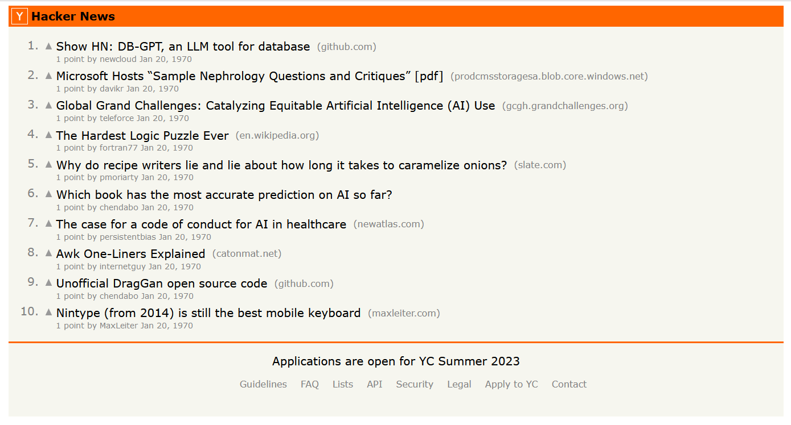

<h2 align="center">Hacker News Clone Angular/NgRx</h2>

This is a minimalistic clone of [Hackernews](https://news.ycombinator.com/news) built with Angular and NgRx.

Built using the [Hackernews REST API](https://github.com/HackerNews/API).

It is intended to be an exercise of using together standalone Angular components with functional single file ngrx store.

<p align="center" margin-bottom="0">
  
</p>

## Installation

1. **Clone the project**

```
 git clone https://github.com/evgeniush/ng-standalone-hackernews-clone
 cd ng-standalong-hackernews-clone
```

2. **Install**

```
npm install
```

3. **Run the app  (http://localhost:3000)**

```
npm start
```
